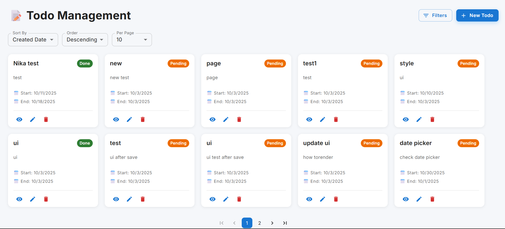
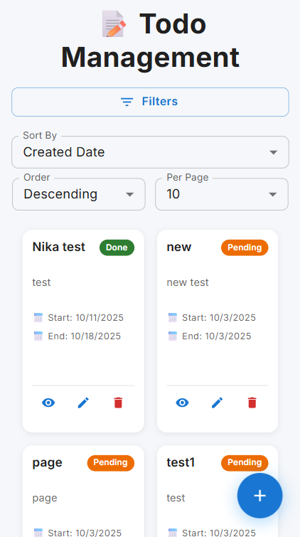
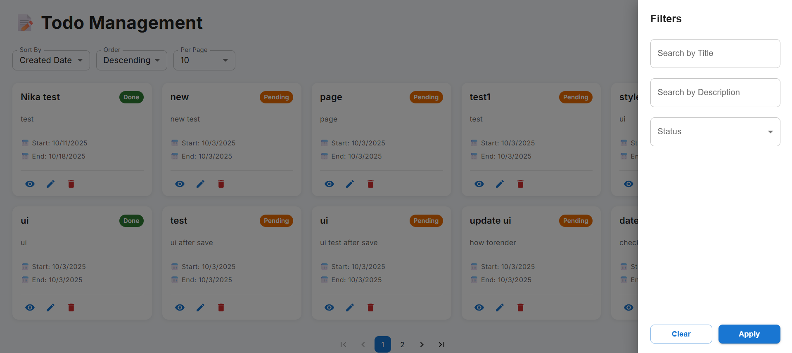
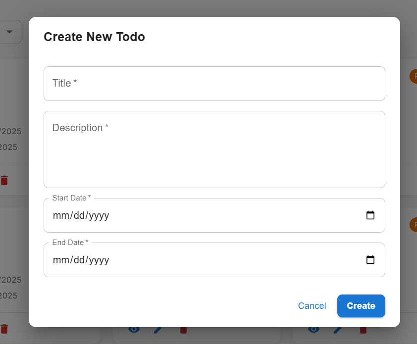

# 📝 Todo Management Application

A modern, full-featured todo management application built with React, TypeScript, Redux Toolkit, and Material-UI. This application provides a complete CRUD interface with advanced features like pagination, sorting, filtering, and a responsive design that works seamlessly on all devices.


### Desktop Responsive View


### Mobile Responsive View


### Filters


### Create Todo



## ✨ Features

### Core Functionality
- ✅ **Full CRUD Operations** - Create, Read, Update, and Delete todos
- 📄 **Pagination** - Navigate through todos with customizable page sizes
- 🔍 **Advanced Filtering** - Filter by title, description, and completion status
- 🔤 **Sorting** - Sort by multiple fields (date, title, status) in ascending/descending order
- 👁️ **Detailed View** - Click any todo to see complete information
- 📱 **Mobile Responsive** - Optimized UI for mobile, tablet, and desktop

### Technical Features
- 🎯 **Type-Safe** - Full TypeScript implementation
- 🗄️ **State Management** - Redux Toolkit for centralized state
- 🔌 **API Integration** - Axios with interceptors for error handling
- 🎨 **Modern UI** - Material-UI components + Tailwind CSS utilities
- ⚡ **Fast Build** - Vite for lightning-fast development
- 🔄 **Real-time Updates** - Instant UI updates with Redux state

## 🚀 Getting Started

### Prerequisites

- **Node.js**: 20.19+ or 22.12+
- **npm**: 10.x or higher

### Installation

1. **Clone the repository**
```bash
git clone <your-repo-url>
cd todo-app
```

2. **Install dependencies**
```bash
npm install
```

3. **Start the development server**
```bash
npm run dev
```

4. **Open your browser**
```
http://localhost:5173
```

## 🏗️ Project Structure

```
todo-app/
├── src/
│   ├── components/         # Reusable UI components (future)
│   ├── features/
│   │   └── todos/
│   │       └── todosSlice.ts    # Redux slice for todos
│   ├── services/
│   │   └── api.ts              # API service with Axios
│   ├── store/
│   │   ├── store.ts            # Redux store configuration
│   │   └── hooks.ts            # Typed Redux hooks
│   ├── types/
│   │   └── todo.types.ts       # TypeScript interfaces
│   ├── App.tsx                 # Main application component
│   ├── main.tsx                # Application entry point
│   └── index.css               # Global styles
├── public/                     # Static assets
├── tailwind.config.js          # Tailwind CSS configuration
├── vite.config.ts              # Vite configuration
├── tsconfig.json               # TypeScript configuration
└── package.json                # Dependencies and scripts
```

## 🛠️ Technologies

### Frontend Framework
- **React 18** - UI library
- **TypeScript** - Type safety
- **Vite** - Build tool and dev server

### State Management
- **Redux Toolkit** - State management
- **Redux Thunk** - Async actions (built into Redux Toolkit)

### UI & Styling
- **Material-UI (MUI)** - Component library
- **Tailwind CSS** - Utility-first CSS
- **@emotion** - CSS-in-JS (MUI dependency)

### HTTP Client
- **Axios** - API requests with interceptors

### Development Tools
- **ESLint** - Code linting
- **PostCSS** - CSS processing
- **Autoprefixer** - CSS vendor prefixes

## 📡 API Integration

The application connects to the Todo API at:
```
https://todoapp.ideallteam.com/api
```

### API Endpoints Used
- `GET /todos/get` - Fetch todos with pagination and filters
- `GET /todos/{id}` - Fetch single todo
- `POST /todos/` - Create new todo
- `PUT /todos/{id}` - Update todo
- `DELETE /todos/{id}` - Delete todo

### CORS Handling
The project uses Vite's proxy feature to handle CORS issues during development. See `vite.config.ts` for configuration.

## 🎯 Usage Guide

### Creating a Todo
1. Click the **"New Todo"** button (or **+** button on mobile)
2. Fill in all required fields:
   - Title
   - Description
   - Start Date
   - End Date
3. Click **"Create"**

### Viewing Todo Details
1. Click the **eye icon** 👁️ on any todo card
2. View complete information including timestamps
3. Edit or delete directly from the details dialog

### Editing a Todo
1. Click the **edit icon** ✏️ on any todo card
2. Modify the fields
3. Toggle completion status if needed
4. Click **"Update"**

### Deleting a Todo
1. Click the **delete icon** 🗑️ on any todo card
2. Confirm the deletion
3. Todo is removed immediately

### Filtering Todos
1. Click the **"Filters"** button
2. Enter search criteria:
   - Search by title (partial match)
   - Search by description (partial match)
   - Filter by status (All/Pending/Completed)
3. Click **"Apply"** to filter
4. Click **"Clear"** to reset filters

### Sorting Todos
Use the dropdown menus to sort by:
- Created Date
- Updated Date
- Title
- Start Date
- End Date
- Completion Status

Choose ascending or descending order.

### Pagination
- Use the pagination controls at the bottom
- Adjust items per page (5, 10, 20, 50)
- Navigate with page numbers or first/last buttons

## 🔧 Configuration

### Environment Variables
No environment variables required. API URL is configured in `src/services/api.ts`.

### Customizing API URL
To change the API endpoint, edit `src/services/api.ts`:
```typescript
const API_BASE_URL = '/api'; // Change this if needed
```

### Customizing Theme
Edit `src/main.tsx` to customize Material-UI theme:
```typescript
const theme = createTheme({
  palette: {
    mode: 'light',
    primary: {
      main: '#1976d2', // Change primary color
    },
    secondary: {
      main: '#dc004e', // Change secondary color
    },
  },
});
```

## 📦 Build for Production

```bash
npm run build
```

This creates an optimized production build in the `dist/` folder.

### Preview Production Build
```bash
npm run preview
```

## 🧪 Scripts

| Command | Description |
|---------|-------------|
| `npm run dev` | Start development server |
| `npm run build` | Build for production |
| `npm run preview` | Preview production build |
| `npm run lint` | Run ESLint |

## 🐛 Troubleshooting

### Port Already in Use
If port 5173 is occupied:
```bash
# Kill the process or change port in vite.config.ts
```

### CORS Errors
Make sure the proxy configuration in `vite.config.ts` is correct:
```typescript
server: {
  proxy: {
    '/api': {
      target: 'https://todoapp.ideallteam.com',
      changeOrigin: true,
      secure: false,
    }
  }
}
```

### Node Version Issues
Ensure you're using Node.js 20+ or 22+:
```bash
node --version  # Should show v20.x.x or v22.x.x
```

### Dependencies Installation Issues
Clear cache and reinstall:
```bash
rm -rf node_modules package-lock.json
npm cache clean --force
npm install
```

## 🚀 Future Enhancements

Potential features for future development:
- [ ] Dark mode toggle
- [ ] Drag & drop todo reordering
- [ ] Todo categories/tags
- [ ] Date range filtering
- [ ] Export todos (CSV/JSON)
- [ ] Bulk operations (select multiple)
- [ ] Todo priority levels
- [ ] Search with debouncing
- [ ] Offline support with service workers
- [ ] User authentication
- [ ] Todo sharing
- [ ] Recurring todos
- [ ] Todo attachments

## 📄 License

This project is open source and available under the [MIT License](LICENSE).

## 👥 Contributing

Contributions are welcome! Please feel free to submit a Pull Request.

1. Fork the repository
2. Create your feature branch (`git checkout -b feature/AmazingFeature`)
3. Commit your changes (`git commit -m 'Add some AmazingFeature'`)
4. Push to the branch (`git push origin feature/AmazingFeature`)
5. Open a Pull Request

## 📧 Support

For issues, questions, or suggestions, please open an issue in the repository.

## 🙏 Acknowledgments

- [React Documentation](https://react.dev/)
- [Redux Toolkit Documentation](https://redux-toolkit.js.org/)
- [Material-UI Documentation](https://mui.com/)
- [Vite Documentation](https://vitejs.dev/)
- [TypeScript Documentation](https://www.typescriptlang.org/)

---

**Built with ❤️ using React, TypeScript, and Redux Toolkit**